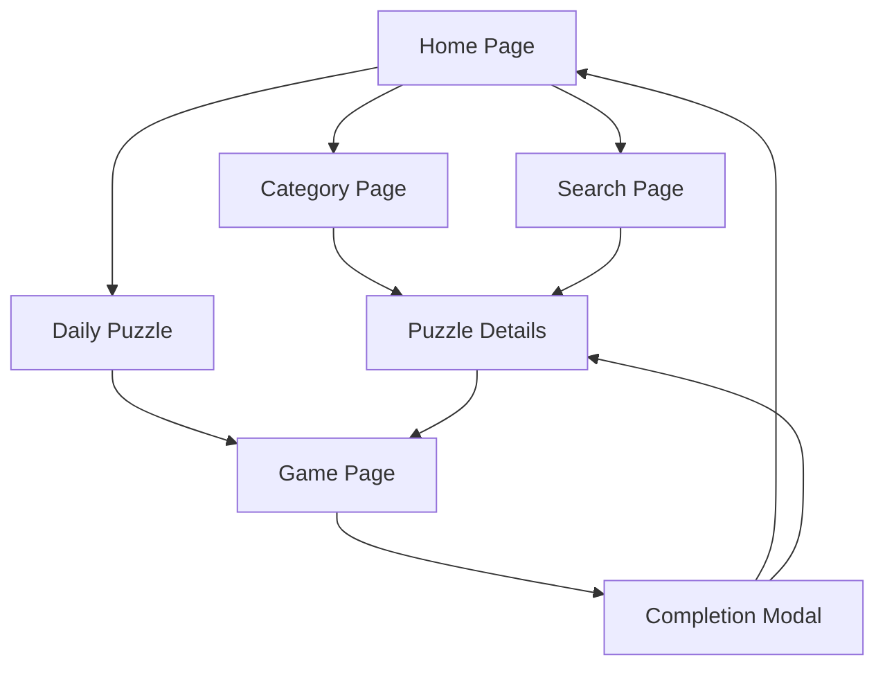

## 1. Product Overview
JigsawWorld is an online jigsaw puzzle gaming website where users can play various puzzle games. Users can explore different puzzle categories, play daily challenges, search for puzzles, and compete with other players through leaderboards.

The platform aims to provide a smooth and engaging puzzle-solving experience with social features and regular content updates to keep users engaged.

## 2. Core Features

### 2.1 User Roles
| Role | Registration Method | Core Permissions |
|------|---------------------|------------------|
| Guest User | No registration required | Browse puzzles, play puzzles, view leaderboards |
| Registered User | Email registration | All guest features + save progress, track statistics, compete in rankings |

### 2.2 Feature Module
Our jigsaw puzzle gaming platform consists of the following main pages:
1. **Home page**: hero section with daily puzzle showcase, today's recommendations, category navigation, and main navigation menu with search functionality.
2. **Category page**: displays all puzzles within a specific category with pagination support.
3. **Puzzle details page**: shows puzzle information, description, user rankings, and game statistics.
4. **Game page**: main puzzle playing interface with drag-and-drop functionality and smooth gameplay experience.
5. **Search page**: displays search results with appropriate messaging for no results found.

### 2.3 Page Details
| Page Name | Module Name | Feature description |
|-----------|-------------|---------------------|
| Home page | Hero section | Display daily puzzle image on the right side with click-to-play functionality, automatic image switching or manual selection |
| Home page | Navigation menu | Include daily puzzle link, explore dropdown (most played this week, most played overall, trending searches), category navigation, search bar, login/register buttons |
| Home page | Today's recommendations | Showcase featured puzzles with thumbnail images and titles |
| Home page | Category entrance | Grid or card layout displaying puzzle categories with preview images |
| Category page | Puzzle list | Display all puzzles in selected category with thumbnails, titles, and difficulty indicators |
| Category page | Pagination | Load more puzzles with numbered pagination or infinite scroll |
| Puzzle details page | Puzzle information | Show full-size preview image, title, description, difficulty level, and completion statistics |
| Puzzle details page | User leaderboard | Display top players who completed this puzzle with completion times and rankings |
| Puzzle details page | Game statistics | Show total plays, average completion time, and user ratings if available |
| Puzzle details page | Play button | Prominent play button that navigates to the game page |
| Game page | Puzzle board | Central playing area with puzzle pieces scattered around the edges |
| Game page | Puzzle pieces | Display puzzle pieces with proper image content from corresponding grid positions |
| Game page | Drag and drop | Enable smooth dragging of pieces with snap-to-grid functionality for correct placements |
| Game page | Group movement | Allow connected pieces to be moved together as a group |
| Game page | Completion detection | Automatically detect when puzzle is completed and show celebration modal |
| Game page | Progress tracking | Display completion percentage and time elapsed |
| Search page | Search results | Show matching puzzles in list format with thumbnails and basic information |
| Search page | No results handling | Display friendly message suggesting alternative search terms when no results found |

## 3. Core Process

### Guest User Flow
1. User visits homepage and sees daily puzzle recommendation
2. User can browse categories or use search to find puzzles
3. User clicks on a puzzle to view details and rankings
4. User clicks play button to start the puzzle game
5. User drags pieces to complete the puzzle
6. Completion modal shows when puzzle is finished

### Registered User Flow
1. User registers/login to access additional features
2. User can save puzzle progress and track statistics
3. User appears on leaderboards with completion times
4. User can rate puzzles and leave feedback

## 4. User Interface Design

### 4.1 Design Style
- **Primary colors**: Deep blue (#1e40af) for primary actions, warm orange (#f97316) for accents
- **Secondary colors**: Light gray (#f3f4f6) for backgrounds, dark gray (#374151) for text
- **Button style**: Rounded corners with subtle shadows, hover effects for interactivity
- **Font**: Inter for headings, system-ui for body text, 16px base size
- **Layout style**: Card-based design with consistent spacing, top navigation bar
- **Icons**: Heroicons for consistent iconography, emoji sparingly for engagement

### 4.2 Page Design Overview
| Page Name | Module Name | UI Elements |
|-----------|-------------|-------------|
| Home page | Hero section | Large puzzle preview image (600x400px) with overlay play button, smooth transitions between daily puzzles |
| Home page | Navigation | Fixed top bar with logo, menu items, search input (250px width), login/register buttons aligned right |
| Home page | Recommendations | 3-column grid layout, card height 200px with image preview and title overlay |
| Home page | Categories | 4-column grid on desktop, 2-column on mobile, category cards with background images and centered titles |
| Category page | Puzzle grid | Responsive grid (4 columns desktop, 2 tablet, 1 mobile), card-based layout with hover effects |
| Category page | Pagination | Centered numbered pagination with previous/next buttons, current page highlighted |
| Puzzle details page | Main content | Two-column layout (70/30 split), large puzzle preview on left, info panel on right |
| Puzzle details page | Leaderboard | Scrollable list showing top 10 players with rank, username, completion time |
| Game page | Puzzle area | Full-screen layout with puzzle board centered, pieces arranged around perimeter |
| Game page | Controls | Top bar showing progress percentage, timer, and pause/reset buttons |
| Search page | Results list | Vertical list layout with thumbnail images (120x120px) and puzzle details |

### 4.3 Responsiveness
- **Desktop-first approach**: Optimized for 1920x1080 and 1366x768 resolutions
- **Mobile adaptation**: Responsive breakpoints at 768px and 480px
- **Touch optimization**: Larger touch targets (minimum 44px) for mobile devices
- **Performance**: Lazy loading for images, optimized piece rendering for smooth gameplay

### 4.4 SEO Best Practices
- **Meta tags**: Unique title and description for each page with puzzle-specific keywords
- **Structured data**: JSON-LD schema for games and organizations
- **URL structure**: Clean, descriptive URLs with puzzle titles (/p/daily-mountain-landscape)
- **Image optimization**: WebP format with fallbacks, proper alt text for all images
- **Sitemap**: Dynamic XML sitemap generation for all puzzle pages
- **Performance**: Core Web Vitals optimization, server-side rendering for initial page load