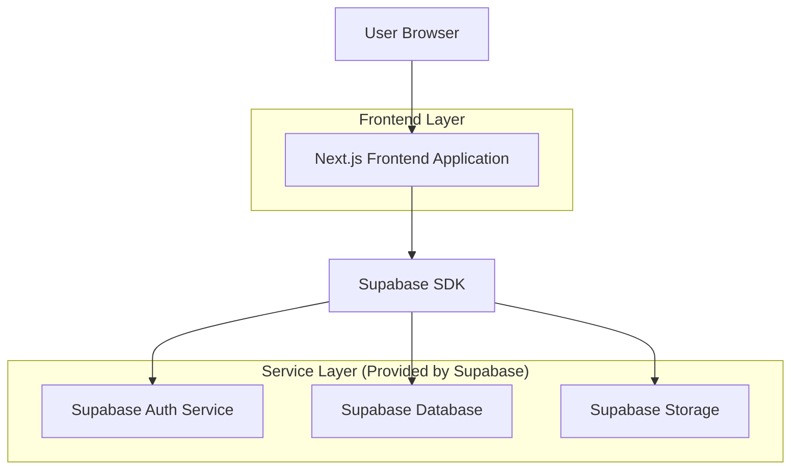
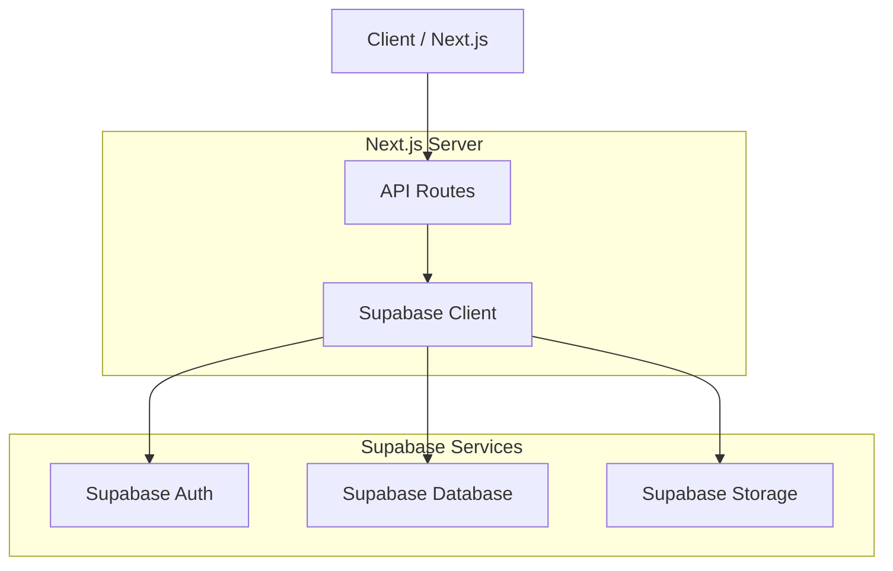
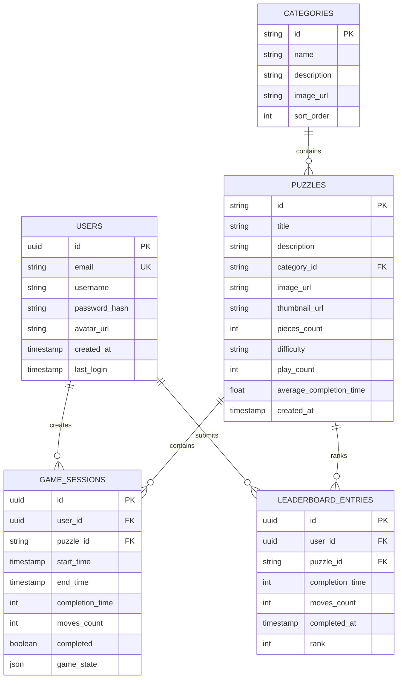

## 1. Architecture design



## 2. Technology Description

* **Frontend**: Next.js 15 + React 18 + Tailwind CSS v4 + TypeScript

* **Initialization Tool**: create-next-app

* **Backend**: Supabase (Database + Auth + Storage)

* **State Management**: React Context + SWR for data fetching

* **UI Components**: Headless UI for accessible components

## 3. Route definitions

| Route             | Purpose                                                               |
| ----------------- | --------------------------------------------------------------------- |
| /                 | Home page with daily puzzle, recommendations, and category navigation |
| /daily            | Daily puzzle challenge page                                           |
| /c/\[categoryId]  | Category page displaying puzzles in specific category                 |
| /p/\[puzzleId]    | Puzzle details page with information and leaderboard                  |
| /play/\[puzzleId] | Main puzzle game interface                                            |
| /search           | Search results page                                                   |
| /auth/login       | User login page                                                       |
| /auth/register    | User registration page                                                |
| /profile          | User profile and statistics page                                      |

## 4. API definitions

### 4.1 Puzzle Management APIs

**Get Puzzle Details**

```
GET /api/puzzles/[puzzleId]
```

Response:

```json
{
  "id": "puzzle-123",
  "title": "Mountain Landscape",
  "description": "Beautiful mountain scenery puzzle",
  "imageUrl": "https://storage.supabase.co/puzzles/mountain.jpg",
  "difficulty": "medium",
  "pieces": 500,
  "categoryId": "nature",
  "createdAt": "2024-01-15T00:00:00Z"
}
```

**Get Category Puzzles**

```
GET /api/categories/[categoryId]/puzzles?page=1&limit=20
```

Response:

```json
{
  "puzzles": [
    {
      "id": "puzzle-123",
      "title": "Mountain Landscape",
      "thumbnailUrl": "https://storage.supabase.co/puzzles/mountain-thumb.jpg",
      "difficulty": "medium",
      "playCount": 1250
    }
  ],
  "total": 45,
  "page": 1,
  "totalPages": 3
}
```

**Search Puzzles**

```
GET /api/search?q=mountain&page=1
```

### 4.2 Game APIs

**Start Puzzle Game**

```
POST /api/games/start
```

Request:

```json
{
  "puzzleId": "puzzle-123",
  "userId": "user-456" // optional for guests
}
```

**Submit Game Completion**

```
POST /api/games/complete
```

Request:

```json
{
  "gameId": "game-789",
  "completionTime": 1800, // seconds
  "moves": 245
}
```

### 4.3 Leaderboard APIs

**Get Puzzle Leaderboard**

```
GET /api/puzzles/[puzzleId]/leaderboard?limit=10
```

Response:

```json
{
  "leaderboard": [
    {
      "rank": 1,
      "username": "PuzzleMaster",
      "completionTime": 1200,
      "completedAt": "2024-01-20T15:30:00Z"
    }
  ]
}
```

## 5. Server architecture diagram



## 6. Data model

### 6.1 Data model definition



### 6.2 Data Definition Language

**Users Table**

```sql
-- create table
CREATE TABLE users (
  id UUID PRIMARY KEY DEFAULT gen_random_uuid(),
  email VARCHAR(255) UNIQUE NOT NULL,
  username VARCHAR(50) UNIQUE NOT NULL,
  password_hash VARCHAR(255) NOT NULL,
  avatar_url TEXT,
  created_at TIMESTAMP WITH TIME ZONE DEFAULT NOW(),
  last_login TIMESTAMP WITH TIME ZONE
);

-- create indexes
CREATE INDEX idx_users_email ON users(email);
CREATE INDEX idx_users_username ON users(username);
```

**Categories Table**

```sql
-- create table
CREATE TABLE categories (
  id VARCHAR(50) PRIMARY KEY,
  name VARCHAR(100) NOT NULL,
  description TEXT,
  image_url TEXT,
  sort_order INTEGER DEFAULT 0,
  created_at TIMESTAMP WITH TIME ZONE DEFAULT NOW()
);

-- insert initial categories
INSERT INTO categories (id, name, description, image_url, sort_order) VALUES
('nature', 'Nature', 'Beautiful natural landscapes and scenery', '/categories/nature.jpg', 1),
('animals', 'Animals', 'Cute and majestic animals from around the world', '/categories/animals.jpg', 2),
('architecture', 'Architecture', 'Stunning buildings and structures', '/categories/architecture.jpg', 3),
('art', 'Art & Culture', 'Famous artworks and cultural pieces', '/categories/art.jpg', 4);
```

**Puzzles Table**

```sql
-- create table
CREATE TABLE puzzles (
  id VARCHAR(100) PRIMARY KEY,
  title VARCHAR(255) NOT NULL,
  description TEXT,
  category_id VARCHAR(50) REFERENCES categories(id),
  image_url TEXT NOT NULL,
  thumbnail_url TEXT NOT NULL,
  pieces_count INTEGER NOT NULL CHECK (pieces_count > 0),
  difficulty VARCHAR(20) CHECK (difficulty IN ('easy', 'medium', 'hard')),
  play_count INTEGER DEFAULT 0,
  average_completion_time INTEGER,
  created_at TIMESTAMP WITH TIME ZONE DEFAULT NOW()
);

-- create indexes
CREATE INDEX idx_puzzles_category ON puzzles(category_id);
CREATE INDEX idx_puzzles_difficulty ON puzzles(difficulty);
CREATE INDEX idx_puzzles_play_count ON puzzles(play_count DESC);
```

**Game Sessions Table**

```sql
-- create table
CREATE TABLE game_sessions (
  id UUID PRIMARY KEY DEFAULT gen_random_uuid(),
  user_id UUID REFERENCES users(id),
  puzzle_id VARCHAR(100) REFERENCES puzzles(id),
  start_time TIMESTAMP WITH TIME ZONE DEFAULT NOW(),
  end_time TIMESTAMP WITH TIME ZONE,
  completion_time INTEGER,
  moves_count INTEGER DEFAULT 0,
  completed BOOLEAN DEFAULT FALSE,
  game_state JSONB,
  created_at TIMESTAMP WITH TIME ZONE DEFAULT NOW()
);

-- create indexes
CREATE INDEX idx_game_sessions_user ON game_sessions(user_id);
CREATE INDEX idx_game_sessions_puzzle ON game_sessions(puzzle_id);
CREATE INDEX idx_game_sessions_completed ON game_sessions(completed);
```

**Leaderboard Entries Table**

```sql
-- create table
CREATE TABLE leaderboard_entries (
  id UUID PRIMARY KEY DEFAULT gen_random_uuid(),
  user_id UUID REFERENCES users(id),
  puzzle_id VARCHAR(100) REFERENCES puzzles(id),
  completion_time INTEGER NOT NULL,
  moves_count INTEGER NOT NULL,
  completed_at TIMESTAMP WITH TIME ZONE DEFAULT NOW(),
  rank INTEGER,
  UNIQUE(user_id, puzzle_id)
);

-- create indexes
CREATE INDEX idx_leaderboard_puzzle ON leaderboard_entries(puzzle_id);
CREATE INDEX idx_leaderboard_completion_time ON leaderboard_entries(completion_time ASC);
CREATE INDEX idx_leaderboard_completed_at ON leaderboard_entries(completed_at DESC);
```

**Row Level Security (RLS) Policies**

```sql
-- Enable RLS
ALTER TABLE users ENABLE ROW LEVEL SECURITY;
ALTER TABLE puzzles ENABLE ROW LEVEL SECURITY;
ALTER TABLE game_sessions ENABLE ROW LEVEL SECURITY;
ALTER TABLE leaderboard_entries ENABLE ROW LEVEL SECURITY;

-- Grant permissions
GRANT SELECT ON puzzles TO anon;
GRANT SELECT ON categories TO anon;
GRANT SELECT ON leaderboard_entries TO anon;
GRANT ALL ON game_sessions TO authenticated;
GRANT ALL ON leaderboard_entries TO authenticated;
GRANT UPDATE ON users TO authenticated;
```

